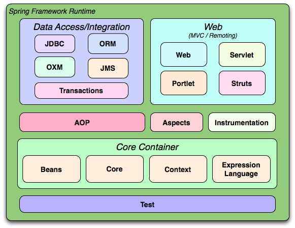

# Apps Java modernas y rápidas con Spring Boot
TypeScript es un lenguaje de programación de código abierto desarrollado por Microsoft, que extiende JavaScript al agregar tipos estáticos opcionales. Fue diseñado para facilitar el desarrollo de aplicaciones JavaScript a gran escala, permitiendo a los desarrolladores detectar errores y mejorar la mantenibilidad del código. 

## Índice de contenidos
* [Spring Framework](#que-es-spring-framework)
* [Spring Boot](#spring-boot-vs-spring)

## ¿Qué es Spring Framework?
Spring Framework es un marco de desarrollo en Java que facilita la creación de aplicaciones de software, especialmente las basadas en Java empresarial. Se centra en ayudar a los desarrolladores a construir aplicaciones de manera modular y escalable mediante el uso de patrones de diseño, inyección de dependencias y un conjunto de bibliotecas de soporte. Sus principales características incluyen:

1. **Inversión de Control (IoC)**: Permite gestionar las dependencias de una aplicación de manera automatizada a través del uso de contenedores de IoC (por ejemplo, ApplicationContext). Spring permite que los objetos se configuren y se ensamblen en lugar de ser creados manualmente, facilitando el manejo de dependencias.

2. **Inyección de Dependencias (DI)**: Facilita la integración y prueba de componentes de la aplicación mediante la inyección de objetos o dependencias, generalmente a través de anotaciones (@Autowired, @Component, etc.) o XML.

3. **Programación Orientada a Aspectos (AOP)**: Permite la separación de preocupaciones transversales (como el manejo de transacciones, la seguridad y el logging) de la lógica principal, facilitando la mantenibilidad.

4. **Spring Data**: Simplifica el acceso a bases de datos al ofrecer implementaciones y métodos predefinidos para los repositorios. Por ejemplo, CrudRepository y JpaRepository reducen la necesidad de escribir consultas SQL personalizadas.

5. **Spring MVC**: Ofrece una estructura para desarrollar aplicaciones web siguiendo el patrón Model-View-Controller (MVC). Esto incluye manejo de peticiones HTTP, vistas y lógica de negocio separadas de la interfaz.

6. **Spring Boot**: Una extensión de Spring que simplifica la creación de aplicaciones al incluir una configuración y un conjunto de dependencias predeterminadas. Facilita la creación de aplicaciones listas para producción con un enfoque de “convención sobre configuración”.

7. **Spring Security**: Proporciona una solución de seguridad extensible para autenticación, autorización y manejo de roles.

Spring Framework es especialmente útil para construir aplicaciones empresariales robustas y escalables en Java, ya sea para proyectos en la nube, microservicios, sistemas distribuidos, o aplicaciones tradicionales.

## Spring Boot vs Spring
La principal diferencia entre Spring y Spring Boot radica en que Spring Boot es una extensión de Spring Framework diseñada para simplificar y agilizar el proceso de configuración y desarrollo de aplicaciones. A continuación, te detallo las diferencias clave:

1. Configuración y Simplicidad
- Spring: Requiere una configuración más detallada y personalizada. Para usar Spring, tradicionalmente necesitas configurar muchos archivos XML o usar varias anotaciones, lo cual puede resultar en un proceso laborioso y complicado, especialmente en aplicaciones grandes.
- Spring Boot: Minimiza la configuración necesaria al seguir el principio de "convención sobre configuración". Usa configuraciones predeterminadas y dependencias automáticas que eliminan gran parte de la configuración manual.

2. Inicio rápido de aplicaciones
- Spring: En una aplicación Spring estándar, necesitas configurar un servidor de aplicaciones o un contenedor de servlets (como Tomcat o Jetty) para desplegar la aplicación.
- Spring Boot: Viene con un servidor web embebido (como Tomcat o Jetty), lo que permite ejecutar la aplicación como un archivo ejecutable JAR. Solo necesitas ejecutar el JAR para iniciar la aplicación sin requerir configuraciones adicionales de servidor.

3. Gestión de dependencias
- Spring: Requiere que los desarrolladores gestionen manualmente todas las dependencias necesarias en el archivo de configuración (como pom.xml en Maven o build.gradle en Gradle).
- Spring Boot: Incluye "starters" de dependencias, que son conjuntos predefinidos de dependencias para diferentes tipos de aplicaciones. Por ejemplo, spring-boot-starter-web incluye todas las dependencias necesarias para una aplicación web, incluyendo Spring MVC, un servidor embebido y otras bibliotecas necesarias.

4. Configuración de propiedades
- Spring: Para configurar propiedades de la aplicación, generalmente tienes que definir un archivo applicationContext.xml o configuraciones en Java.
- Spring Boot: Utiliza archivos de configuración application.properties o application.yml, donde puedes definir propiedades específicas del entorno de ejecución de forma simple. Esto también facilita la configuración de distintos entornos (desarrollo, prueba, producción).

5. Herramientas y utilidades de monitorización
- Spring: No incluye herramientas de monitorización integradas, por lo que necesitas configurarlas manualmente si las requieres.
- Spring Boot: Proporciona Spring Boot Actuator, un conjunto de endpoints para monitorizar y administrar la aplicación (por ejemplo, ver el estado de la aplicación, métricas, información del sistema). Esto facilita el monitoreo y la administración en entornos de producción.

6. **Soporte para microservicios**
- Spring: Aunque Spring es modular y puede usarse en una arquitectura de microservicios, requiere una configuración y planificación cuidadosa para hacerlo efectivo.
- Spring Boot: Es ideal para microservicios debido a su configuración ligera y rápida, además de que puede funcionar como un servicio independiente, simplificando la implementación de arquitecturas de microservicios.

### Code Conventions

Las **Java Code Conventions** son un conjunto de normas y prácticas recomendadas que los desarrolladores de Java deben seguir al escribir código. Estas convenciones fueron establecidas originalmente por Sun Microsystems y posteriormente por Oracle, con el objetivo de hacer que el código sea más legible, mantenible y consistente entre diferentes equipos de desarrollo.

Seguir estas convenciones facilita la colaboración en proyectos grandes y el mantenimiento a largo plazo del código, ya que las reglas ayudan a garantizar que el código escrito por diferentes desarrolladores tenga un estilo coherente.

Principales [convenciones](https://www.oracle.com/java/technologies/javase/codeconventions-contents.html) de código en Java:
- Nombres de clases:
    - Las clases deben tener nombres en CamelCase (cada palabra comienza con mayúscula).
    - Ejemplo: `CustomerService`, `EmployeeDetails`.
- Nombres de métodos:
    - Los métodos deben comenzar con una letra minúscula y usar camelCase.
    - Ejemplo: `calculateTotal()`, `findCustomerById()`.
- Nombres de variables:
    - Las variables también deben utilizar camelCase.
    - Ejemplo: `customerName`, `totalAmount`.
- Nombres de constantes:
    - Las constantes se escriben en mayúsculas completas separadas por guiones bajos (_).
    - Ejemplo: `MAX_HEIGHT`, `DEFAULT_TIMEOUT`.
- Nombres de variables:
    - Las variables también deben utilizar camelCase.
    - Ejemplo: `customerName`, `totalAmount`.
- Nombres de constantes:
    - Las constantes se escriben en mayúsculas completas separadas por guiones bajos (_).
    - Ejemplo: `MAX_HEIGHT`, `DEFAULT_TIMEOUT`.
- Indentación:
    - Se recomienda usar 4 espacios por nivel de indentación en lugar de un tabulador.
    - Facilita la legibilidad del código en editores diferentes.
- Longitud de las líneas:
    - Se sugiere que las líneas de código no superen los 80 caracteres de largo. Si es necesario, se debe dividir la línea para mejorar la legibilidad.

## Build Tools
Son herramientas que ayudan a automatizar tareas (ciclo de vida de un desarrollo).

### Maven
Maven es una herramienta de gestión y construcción de proyectos, principalmente usada en proyectos Java. Facilita la automatización de tareas como la compilación del código, la ejecución de pruebas, la creación de paquetes (como archivos JAR o WAR) y la gestión de dependencias de terceros. Su principal propósito es simplificar y estandarizar el ciclo de vida del desarrollo de software, especialmente en proyectos que involucran muchas bibliotecas externas.

#### Caracteristicas
- Gestión de dependencias: Maven permite especificar todas las dependencias externas que un proyecto necesita (bibliotecas, frameworks, etc.) en un archivo llamado pom.xml. Maven se encarga de descargarlas automáticamente desde repositorios remotos y de administrarlas.

- Ciclo de vida de construcción: Maven define un conjunto de fases que cubren las etapas de construcción de un proyecto. Estas incluyen fases como la compilación (compile), las pruebas (test), el empaquetado (package), la verificación (verify) y la instalación (install).

- Estandarización: Maven usa una estructura de proyecto estándar y un archivo de configuración XML (pom.xml). Esto permite que cualquier desarrollador pueda entender y trabajar en un proyecto Maven fácilmente, independientemente de cómo esté estructurado.

- Plugins: Maven es extensible mediante plugins, que ofrecen una variedad de funcionalidades para tareas específicas, como generar documentación, ejecutar pruebas unitarias, o compilar archivos de recursos adicionales.

[¿Que es maven y cómo funciona?](https://www.arquitecturajava.com/que-es-maven/)

