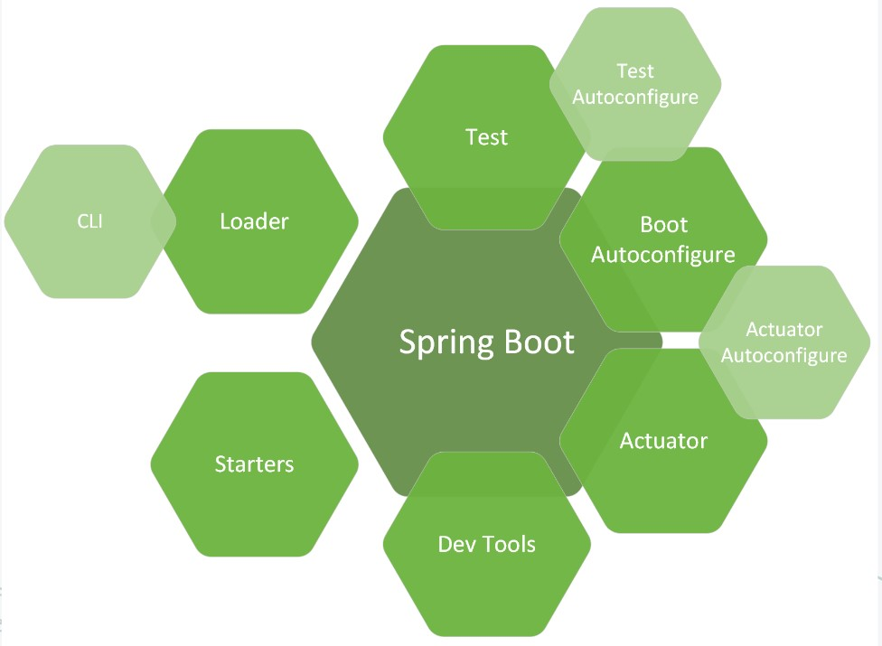
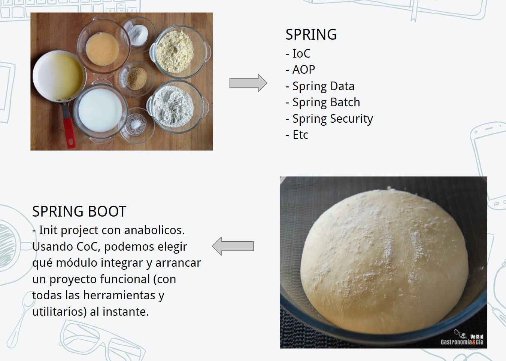

# Apps Java modernas y rápidas con Spring Boot
Java Spring Boot es una herramienta de código abierto que permite crear aplicaciones web y microservicios con Java. Spring Boot es una extensión del marco de trabajo Spring, que permite desarrollar aplicaciones de diferentes tipos, como aplicaciones web, de escritorio, de línea de comando, microservicios, entre otras.
Java Spring Boot facilita el desarrollo de aplicaciones gracias a sus características, como la configuración automática, que reduce el tiempo y el esfuerzo de desarrollo. Además, la configuración inicial acelera el desarrollo y reduce la posibilidad de errores humanos

## Índice de contenidos
* [Spring Framework](#que-es-spring-framework)
* [Spring Boot vs Spring](#spring-boot-vs-spring)

## ¿Qué es Spring Framework?
Spring Framework es un marco de desarrollo en Java que facilita la creación de aplicaciones de software, especialmente las basadas en Java empresarial. Se centra en ayudar a los desarrolladores a construir aplicaciones de manera modular y escalable mediante el uso de patrones de diseño, inyección de dependencias y un conjunto de bibliotecas de soporte. Sus principales características incluyen:

1. **Inversión de Control (IoC)**: Permite gestionar las dependencias de una aplicación de manera automatizada a través del uso de contenedores de IoC (por ejemplo, ApplicationContext). Spring permite que los objetos se configuren y se ensamblen en lugar de ser creados manualmente, facilitando el manejo de dependencias.

2. **Inyección de Dependencias (DI)**: Facilita la integración y prueba de componentes de la aplicación mediante la inyección de objetos o dependencias, generalmente a través de anotaciones (@Autowired, @Component, etc.) o XML.

3. **Programación Orientada a Aspectos (AOP)**: Permite la separación de preocupaciones transversales (como el manejo de transacciones, la seguridad y el logging) de la lógica principal, facilitando la mantenibilidad.

4. **Spring Data**: Simplifica el acceso a bases de datos al ofrecer implementaciones y métodos predefinidos para los repositorios. Por ejemplo, CrudRepository y JpaRepository reducen la necesidad de escribir consultas SQL personalizadas.

5. **Spring MVC**: Ofrece una estructura para desarrollar aplicaciones web siguiendo el patrón Model-View-Controller (MVC). Esto incluye manejo de peticiones HTTP, vistas y lógica de negocio separadas de la interfaz.

6. **Spring Boot**: Una extensión de Spring que simplifica la creación de aplicaciones al incluir una configuración y un conjunto de dependencias predeterminadas. Facilita la creación de aplicaciones listas para producción con un enfoque de “convención sobre configuración”.

7. **Spring Security**: Proporciona una solución de seguridad extensible para autenticación, autorización y manejo de roles.

Spring Framework es especialmente útil para construir aplicaciones empresariales robustas y escalables en Java, ya sea para proyectos en la nube, microservicios, sistemas distribuidos, o aplicaciones tradicionales.


## Spring Boot vs Spring
La principal diferencia entre Spring y Spring Boot radica en que Spring Boot es una extensión de Spring Framework diseñada para simplificar y agilizar el proceso de configuración y desarrollo de aplicaciones. A continuación, te detallo las diferencias clave:

1. Configuración y Simplicidad
- Spring: Requiere una configuración más detallada y personalizada. Para usar Spring, tradicionalmente necesitas configurar muchos archivos XML o usar varias anotaciones, lo cual puede resultar en un proceso laborioso y complicado, especialmente en aplicaciones grandes.
- Spring Boot: Minimiza la configuración necesaria al seguir el principio de "convención sobre configuración". Usa configuraciones predeterminadas y dependencias automáticas que eliminan gran parte de la configuración manual.

2. Inicio rápido de aplicaciones
- Spring: En una aplicación Spring estándar, necesitas configurar un servidor de aplicaciones o un contenedor de servlets (como Tomcat o Jetty) para desplegar la aplicación.
- Spring Boot: Viene con un servidor web embebido (como Tomcat o Jetty), lo que permite ejecutar la aplicación como un archivo ejecutable JAR. Solo necesitas ejecutar el JAR para iniciar la aplicación sin requerir configuraciones adicionales de servidor.

3. Gestión de dependencias
- Spring: Requiere que los desarrolladores gestionen manualmente todas las dependencias necesarias en el archivo de configuración (como pom.xml en Maven o build.gradle en Gradle).
- Spring Boot: Incluye "starters" de dependencias, que son conjuntos predefinidos de dependencias para diferentes tipos de aplicaciones. Por ejemplo, spring-boot-starter-web incluye todas las dependencias necesarias para una aplicación web, incluyendo Spring MVC, un servidor embebido y otras bibliotecas necesarias.

4. Configuración de propiedades
- Spring: Para configurar propiedades de la aplicación, generalmente tienes que definir un archivo applicationContext.xml o configuraciones en Java.
- Spring Boot: Utiliza archivos de configuración application.properties o application.yml, donde puedes definir propiedades específicas del entorno de ejecución de forma simple. Esto también facilita la configuración de distintos entornos (desarrollo, prueba, producción).

5. Herramientas y utilidades de monitorización
- Spring: No incluye herramientas de monitorización integradas, por lo que necesitas configurarlas manualmente si las requieres.
- Spring Boot: Proporciona Spring Boot Actuator, un conjunto de endpoints para monitorizar y administrar la aplicación (por ejemplo, ver el estado de la aplicación, métricas, información del sistema). Esto facilita el monitoreo y la administración en entornos de producción.

6. **Soporte para microservicios**
- Spring: Aunque Spring es modular y puede usarse en una arquitectura de microservicios, requiere una configuración y planificación cuidadosa para hacerlo efectivo.
- Spring Boot: Es ideal para microservicios debido a su configuración ligera y rápida, además de que puede funcionar como un servicio independiente, simplificando la implementación de arquitecturas de microservicios.







## Spring Boot Initializr

Es una herramienta en línea que facilita la creación de proyectos de Spring Boot de manera rápida y sencilla. Ofrece una interfaz para configurar un proyecto básico de Spring Boot con las dependencias, configuraciones, y estructura mínima necesaria, permitiendo que los desarrolladores comiencen a trabajar en su aplicación sin preocuparse por la configuración inicial.

### Características principales de Spring Boot Initializr
1. **Selección del Proyecto**:

- Permite elegir entre Maven y Gradle como herramientas de construcción, que son las más usadas para manejar dependencias y construir proyectos en Java.

2. **Versión de Spring Boot**:

- Puedes elegir la versión de Spring Boot que deseas usar en tu proyecto, lo que es útil si necesitas una versión específica compatible con tu entorno o con otras dependencias.

3. **Configuración de Dependencias**:

- Ofrece una amplia gama de dependencias o "starters" que puedes seleccionar según el tipo de aplicación que deseas desarrollar. Ejemplos incluyen:
    - `spring-boot-starter-web`: Para aplicaciones web y REST.
    - `spring-boot-starter-data-jpa`: Para trabajar con bases de datos y JPA.
    - `spring-boot-starter-security`: Para agregar autenticación y autorización.
    - `spring-boot-starter-thymeleaf`: Para usar Thymeleaf como motor de plantillas en aplicaciones web.

4. **Opciones de Proyecto Básicas**:

- Puedes especificar información básica del proyecto, como el nombre del proyecto, grupo, artefacto, nombre del paquete base, descripción, y versión de Java.

5. **Generación del Proyecto**:

- Una vez seleccionadas las opciones y dependencias, Spring Boot Initializr genera el proyecto y permite descargarlo como un archivo comprimido (.zip). Este archivo contiene una estructura de proyecto básica, con todos los archivos de configuración y dependencias seleccionadas, listo para importar en un IDE y empezar a trabajar.

6. **Integración con IDEs**:

- Muchos IDEs, como IntelliJ IDEA, Eclipse, y Spring Tool Suite (STS), ofrecen integración directa con Spring Boot Initializr, lo que permite crear un proyecto de Spring Boot sin tener que ir al sitio web.

### ¿Como se usa?

1. Accede a Spring Initializr: 
Abre tu navegador y ve a https://start.spring.io.

2. Configura los detalles del proyecto:
En la página de Spring Initializr, completa los campos básicos de configuración:

- **Project**: Elige **Maven** o **Gradle** según el tipo de proyecto que prefieras.
- **Language**: Selecciona **Java**, **Kotlin**, o **Groovy** (la mayoría de los proyectos suelen usar Java).
- **Spring Boot version**: Selecciona la versión de Spring Boot que necesitas (es recomendable elegir la versión estable más reciente).

- **Opciones adicionales**
    - **Project Metadata**:
        - **Group**: Generalmente el nombre de tu organización o dominio invertido (ej. com.ejemplo).
        - **Artifact**: El nombre de tu proyecto o aplicación (ej. mi-app).
        - **Name**: El nombre de la aplicación.
        - **Description**: Una breve descripción del proyecto.
        - **Package name**: El nombre del paquete base para tu código (generalmente es group + artifact, como com.ejemplo.miapp).
        - **Packaging**: Selecciona JAR o WAR, dependiendo de si necesitas un archivo ejecutable (JAR) o uno que pueda desplegarse en un servidor de aplicaciones como Tomcat (WAR).
        - **Java version**: Selecciona la versión de Java con la que trabajarás.

3. Añade dependencias:
En la sección Dependencies, puedes buscar e incluir dependencias necesarias para tu proyecto. Algunos ejemplos comunes son:

- `Spring Web`: Para crear aplicaciones web y APIs REST.
- `Spring Data JPA`: Para interactuar con bases de datos usando JPA (con Hibernate).
- `Spring Security`: Para agregar seguridad a tu aplicación.
- `Spring Boot DevTools`: Para facilitar el desarrollo con características como recarga automática.

Haz clic en cada dependencia para agregarla al proyecto.

4. Genera y descarga el proyecto:
Una vez configurado todo, haz clic en el botón Generate. Esto descargará un archivo .zip con tu proyecto Spring Boot.

5. Extrae y abre el proyecto en tu IDE:
Descomprime el archivo .zip en una carpeta de tu elección.
Abre tu IDE (como IntelliJ IDEA, Eclipse o Visual Studio Code).
Importa el proyecto como un proyecto Maven o Gradle (según la opción que seleccionaste en Spring Initializr).

6. Ejecuta el proyecto:
Dentro del IDE, navega hasta la clase principal, que estará en el paquete raíz y tendrá una anotación `@SpringBootApplication`. Para ejecutar el proyecto, haz clic derecho sobre la clase y selecciona **Run**, o usa el comando:

```bash
./mvnw spring-boot:run   # Para Maven
./gradlew bootRun         # Para Gradle
```

Tu aplicación Spring Boot ahora está en ejecución y puedes acceder a ella en http://localhost:8080 (o el puerto que hayas configurado).