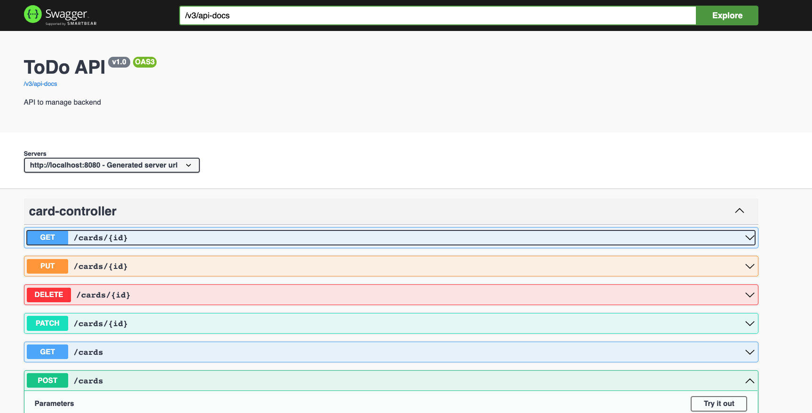
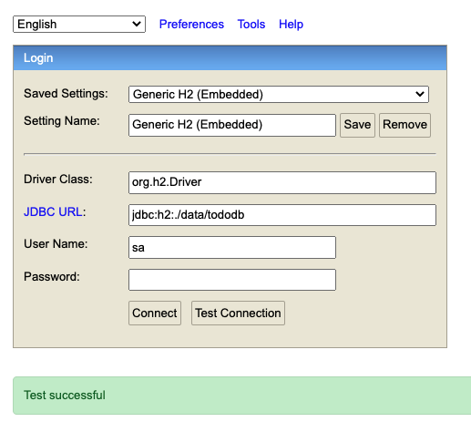
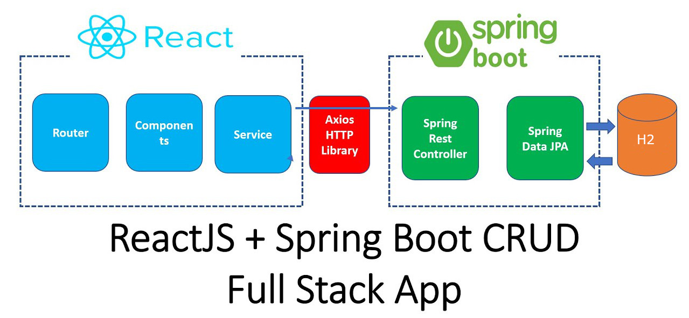

TO DO App
---
Aplicación para gestionar un tablero kanban.

### Pre-requisitos

* [Java 11 (JDK)](https://www.oracle.com/ar/java/technologies/javase/jdk11-archive-downloads.html)

## Instalación

Seguir los siguientes pasos

### Bajar las depependencias del backend
_Ejecutar por consola desde la carpeta del proyecto_

    mvn clean install

##### Generar esquema y eliminar los datos existentes de la BD

_Ejecutar por consola desde la carpeta del proyecto_

     mvn flyway:clean flyway:migrate

##### Ejecutar tests para ver que esté todo en orden
_Ejecutar por consola desde la carpeta del proyecto_

    mvn test

## Ejecución

##### Iniciar aplicación
_Ejecutar por consola desde la carpeta del proyecto_

    mvn spring-boot:run

##### Visualizar la documentación de la API Rest
_Abrir el navegador y poner la siguiente URL_

    http://localhost:8080/todo/swagger-ui.html

##### Conectarse a la BD mediante la consola de H2
_Usar la consola de H2 para visualizar los datos de la BD_

    http://localhost:8080/todo/h2-console

* JDBC URL: jdbc:h2:./data/tododb
* User Name: sa
* Password: password

## Diagrama de Arquitectura 🖇️

#### 

Herramientas
* [Spring boot](https://spring.io/projects/spring-boot) - Framework de java
* [JPA](https://docs.oracle.com/javaee/7/tutorial/persistence-intro.htm) - ORM. Mapear tablas a clases de Java
* [Spring Boot - OpenAPI 3](https://springdoc.org/) - Documentación API Rest
* [H2 Database Engie](https://www.h2database.com/html/main.html) - BD (en files)

Metodología
* [Git Flow](https://www.atlassian.com/git/tutorials/comparing-workflows/gitflow-workflow) - Colaboración y versionado

## Notas 📋
(1) _Se recomienda [IntelliJ Community](https://www.jetbrains.com/idea/download/) o [Eclipse IDE for Enterprise Java Developers](https://www.eclipse.org/downloads/packages/)_ o [Visual Code](https://code.visualstudio.com/)
