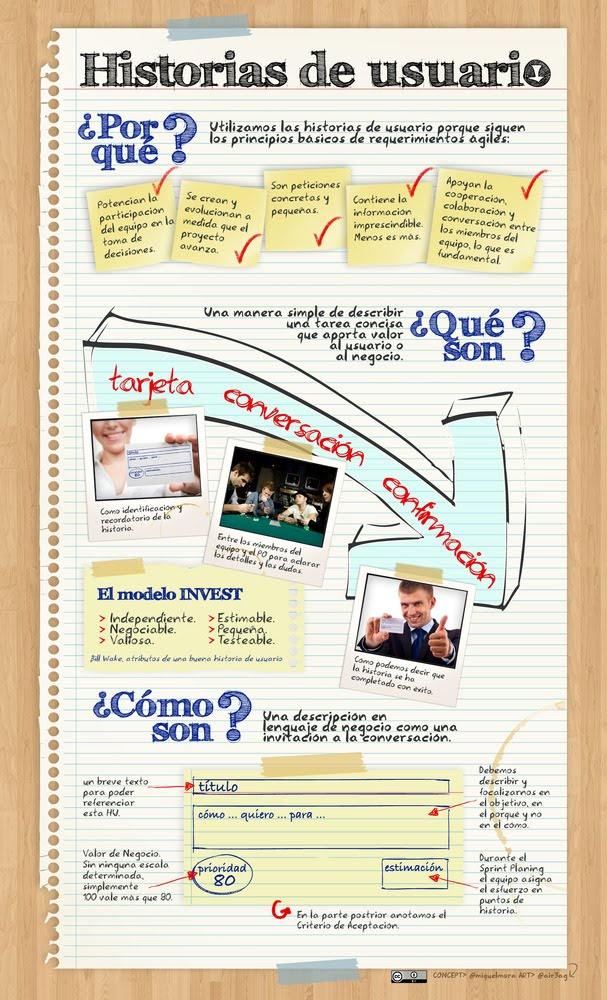

# User Story
Template:
```
COMO [un Rol]
QUIERO [Caracteristicas]
PARA [beneficio Usuario / Negocio]
```

## CCC
- *Card*: Toda historia de usuario debe poder describirse en una ficha de papel pequeña. Si una Historia de Usuario no puede describirse en ese tamaño, es una señal de que estamos traspasando las fronteras y comunicando demasiada información que debería compartirse cara a cara.

- *Conversation*: Toda historia de usuario debe tener una conversación con el Product Owner. Una comunicación cara a cara que intercambia no solo información sino también pensamientos, opiniones y sentimientos.

- *Confirmation*: Toda historia de usuario debe estar lo suficientemente explicada para que el equipo de desarrollo sepa qué es lo que debe construir y qué es lo que el Product Owner espera. Esto se conoce también como Criterios de Aceptación.


## INVEST
Bil Wake inventó el acrónimo INVEST para describir las características de una buena historia:

- *Independiente*: las historias pueden completarse en cualquier orden.
- *Negociable*: los detalles de la historia son co-creados por los programadores y los clientes durante el desarrollo.
- *Valiosa*: la funcionalidad es valiosa para los clientes o los usuarios del software.
- *Estimable*: los pgoramadores pueden encontrar una estimación razonable para construir la historia.
- *Pequeña*: las historias deberían construirse en poco tiempo, generalmente alrededor de "días/persona". Se tienen que poder construir muchas historias en una iteración.
- *Testeable*: se debe poder escribir pruebas que verifiquen que el software de la historia funcione adecuadamente.




## Bibliografía
> [Los elementos de una buena historia de usuario](https://jeronimopalacios.com/product-delivery/los-elementos-una-buena-historia-de-usuario/)

> [El modelo INVEST para crear historias de usuarios efectivas](https://dosideas.com/noticias/metodologias/980-el-modelo-invest-para-crear-historias-de-usuario-efectivas)

